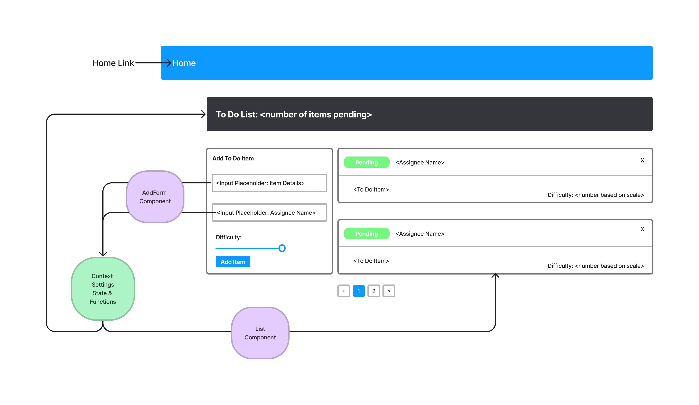

# ToDo App

## Author: Tyler Main

## Credits: Stephanie Hill, Luis Rosales, Stephen Martinez, Demo code

## Phase Four

### branch: api-auth

#### Technical Requirements

1. Implementation of React context API for defining settings across the entire application.

- Context for managing application display settings provided at the application level.
- Display and Hide completed items (boolean).
- Number of items to display per screen (number).

2. Consume and utilize context values throughout your components

- Shows a maximum of a certain number of items per screen in the `<List />` component
  - Uses the Mantine Pagination component to let the users navigate a long list of items
- Hide completed items in the list

#### Pagination Notes

- Only displays the first n items in the list, where n is the number to display per screen in your settings context.
- If you have more than n items in the list, the Pagination Component will add a button that, when clicked, will replace the list with the next n items in the list.
- the Pagination Component also manages the previous (<) and next(>) arrow buttons.

Links:

- [Code Sandbox](https://codesandbox.io/p/github/TylerofArk/todo-app/login-auth?file=%2FREADME.md&workspace=%257B%2522activeFileId%2522%253A%2522cla1voove0001l0hn2k5127nc%2522%252C%2522openFiles%2522%253A%255B%255D%252C%2522sidebarPanel%2522%253A%2522EXPLORER%2522%252C%2522gitSidebarPanel%2522%253A%2522COMMIT%2522%252C%2522sidekickItems%2522%253A%255B%257B%2522key%2522%253A%2522cla1voqvo0067356juj5ehcg2%2522%252C%2522type%2522%253A%2522PROJECT_SETUP%2522%252C%2522isMinimized%2522%253Afalse%257D%252C%257B%2522type%2522%253A%2522PREVIEW%2522%252C%2522taskId%2522%253A%2522start%2522%252C%2522port%2522%253A3000%252C%2522key%2522%253A%2522cla1vpfc000eo356jppr80j06%2522%252C%2522isMinimized%2522%253Afalse%257D%252C%257B%2522type%2522%253A%2522TASK_LOG%2522%252C%2522taskId%2522%253A%2522start%2522%252C%2522key%2522%253A%2522cla1vpawm00bz356job0rei7n%2522%252C%2522isMinimized%2522%253Afalse%257D%255D%257D)

References:

- [Demo Code](https://github.com/codefellows/seattle-code-javascript-401d48)
- [Mantine Pagination Docs](https://mantine.dev/core/pagination/)

## Available Scripts

In the project directory, you can run:

### `npm start`

Runs the app in the development mode.\
Open [http://localhost:3000](http://localhost:3000) to view it in your browser.

The page will reload when you make changes.\
You may also see any lint errors in the console.

### `npm test`

Launches the test runner in the interactive watch mode.\
See the section about [running tests](https://facebook.github.io/create-react-app/docs/running-tests) for more information.

### `npm run build`

Builds the app for production to the `build` folder.\
It correctly bundles React in production mode and optimizes the build for the best performance.

The build is minified and the filenames include the hashes.\
Your app is ready to be deployed!

See the section about [deployment](https://facebook.github.io/create-react-app/docs/deployment) for more information.

### `npm run eject`

**Note: this is a one-way operation. Once you `eject`, you can't go back!**

If you aren't satisfied with the build tool and configuration choices, you can `eject` at any time. This command will remove the single build dependency from your project.

Instead, it will copy all the configuration files and the transitive dependencies (webpack, Babel, ESLint, etc) right into your project so you have full control over them. All of the commands except `eject` will still work, but they will point to the copied scripts so you can tweak them. At this point you're on your own.

You don't have to ever use `eject`. The curated feature set is suitable for small and middle deployments, and you shouldn't feel obligated to use this feature. However we understand that this tool wouldn't be useful if you couldn't customize it when you are ready for it.

## Learn More

You can learn more in the [Create React App documentation](https://facebook.github.io/create-react-app/docs/getting-started).

To learn React, check out the [React documentation](https://reactjs.org/).

### Code Splitting

This section has moved here: [https://facebook.github.io/create-react-app/docs/code-splitting](https://facebook.github.io/create-react-app/docs/code-splitting)

### Analyzing the Bundle Size

This section has moved here: [https://facebook.github.io/create-react-app/docs/analyzing-the-bundle-size](https://facebook.github.io/create-react-app/docs/analyzing-the-bundle-size)

### Making a Progressive Web App

This section has moved here: [https://facebook.github.io/create-react-app/docs/making-a-progressive-web-app](https://facebook.github.io/create-react-app/docs/making-a-progressive-web-app)

### Advanced Configuration

This section has moved here: [https://facebook.github.io/create-react-app/docs/advanced-configuration](https://facebook.github.io/create-react-app/docs/advanced-configuration)

### Deployment

This section has moved here: [https://facebook.github.io/create-react-app/docs/deployment](https://facebook.github.io/create-react-app/docs/deployment)

### `npm run build` fails to minify

This section has moved here: [https://facebook.github.io/create-react-app/docs/troubleshooting#npm-run-build-fails-to-minify](https://facebook.github.io/create-react-app/docs/troubleshooting#npm-run-build-fails-to-minify)